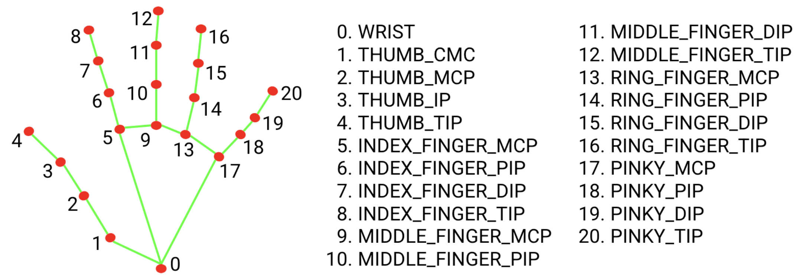
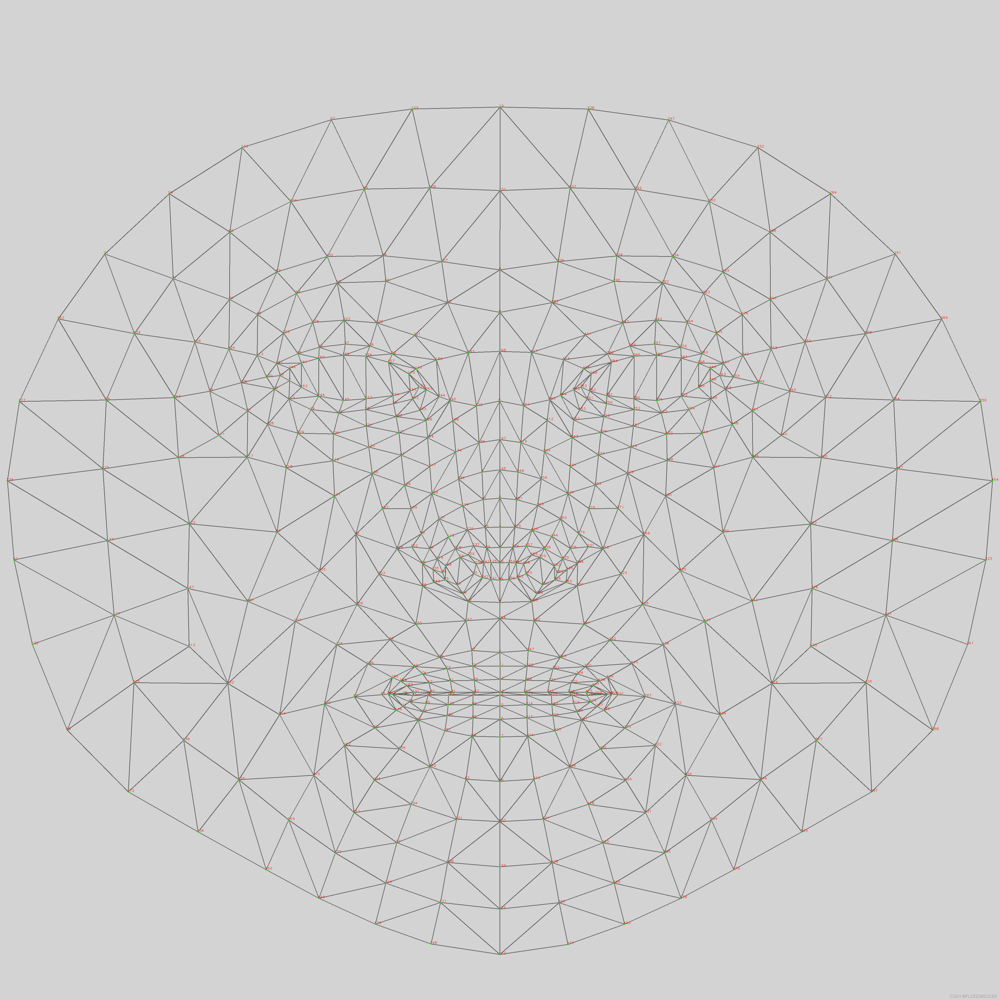

# mediapipe





## handtrack

### SSD | 手掌检测器


```
只有第一帧和手掌消失的时候调用一下，别的时候都是由上一帧来推断下一帧
```


### 手指检测器


### 找到深度

```
这里的深度其实是2.5D
```


### 策略

```js
--1.为什么要设计手掌检测器就是就是解决自遮挡的情况
--2.使用了类似于FPN的 extractor similar 解码器
--3.用的是focal loss 的损失函数
```


### 数据集

```
3d 获取的

用二分类模型来 做正反 实验
```


### 输出

```
1.置信度
2.左右手
3.坐标
```


Webbeyond

Webity

Compotium

webium

Webom

Compowave

webwave

Webzen